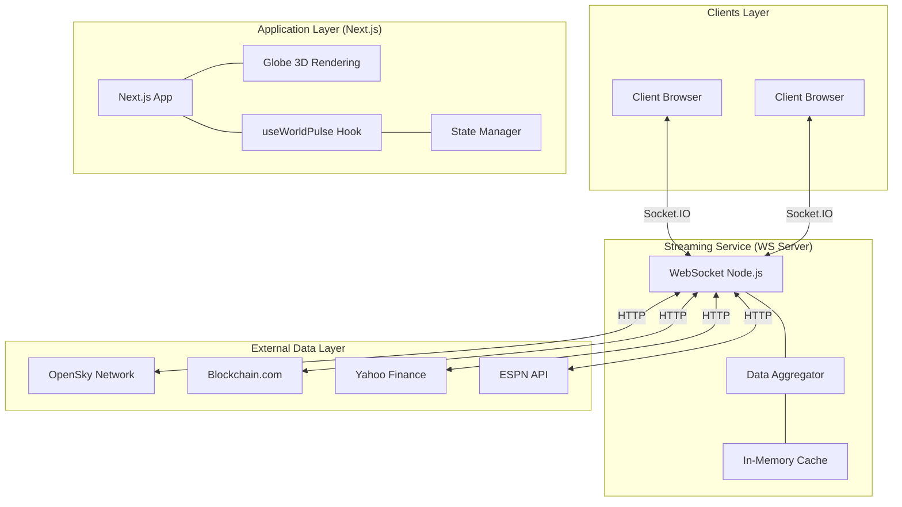
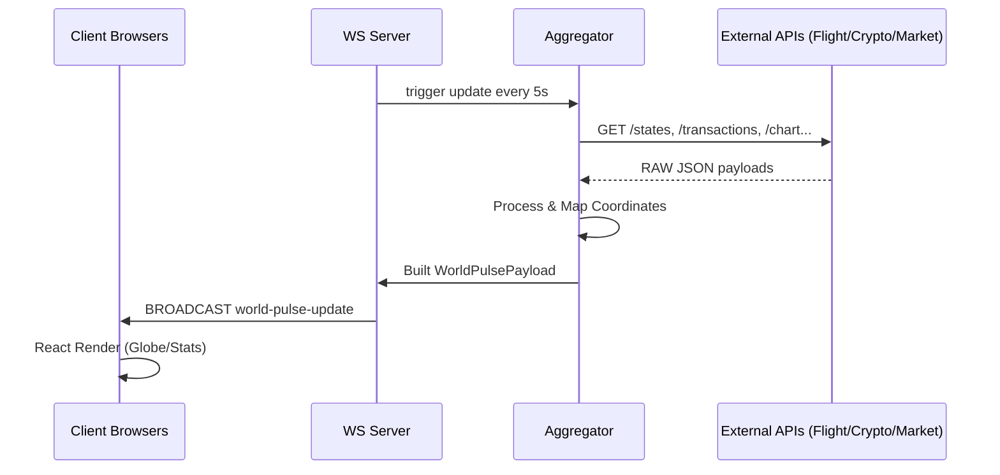
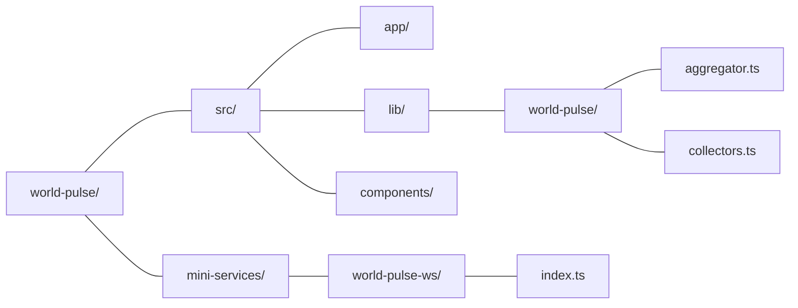

# World Pulse

Real-Time Global Intelligence Dashboard. visualizes global data: flights, blockchain transitions, market indices, and sports.

##  Architecture



##  Data Flow



##  Project Structure



##  Execution

```bash
# Main app environment
bun install
bun run dev

# WebSocket service environment
cd mini-services/world-pulse-ws
bun install
bun run dev
```

---
© 2026 Selma Haci - World Pulse - MIT License
