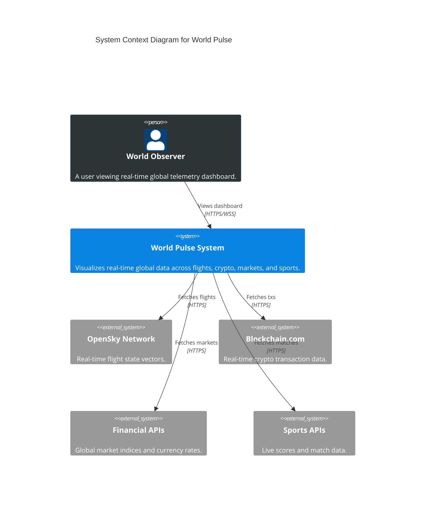
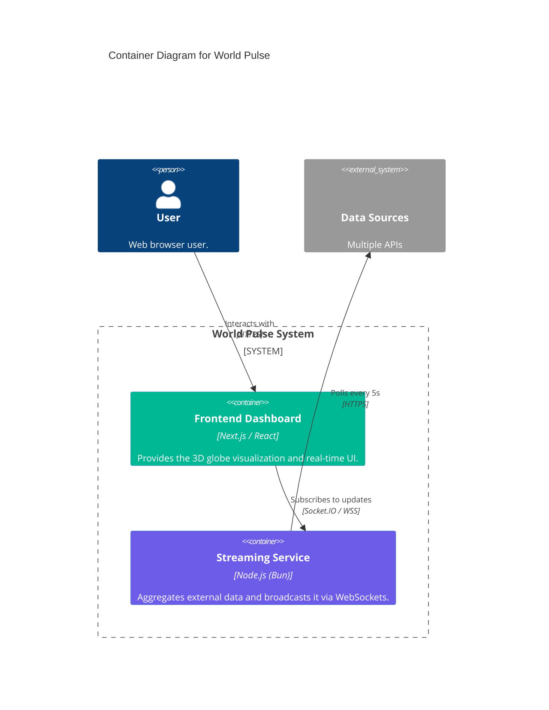
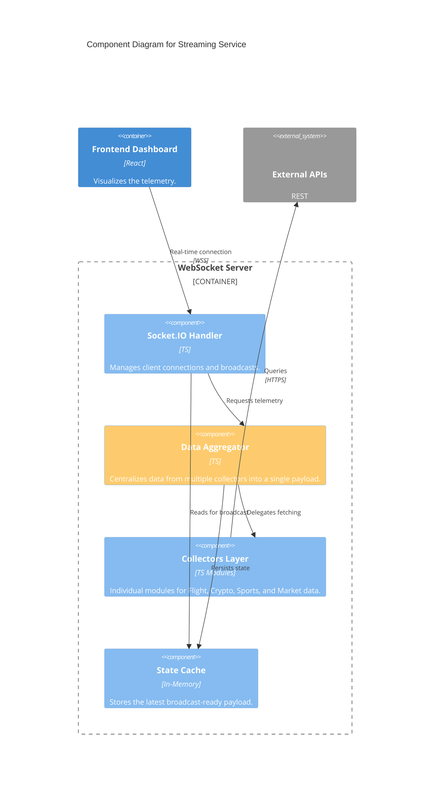
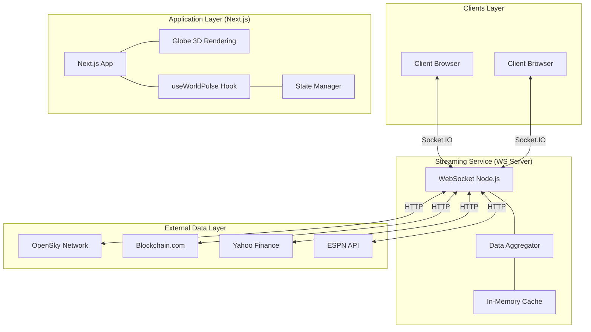
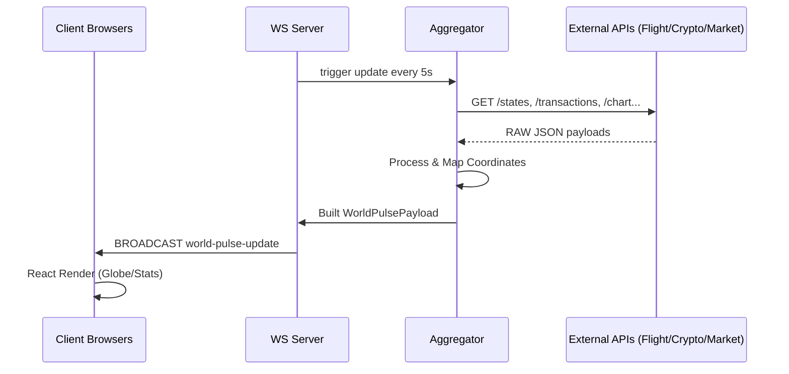
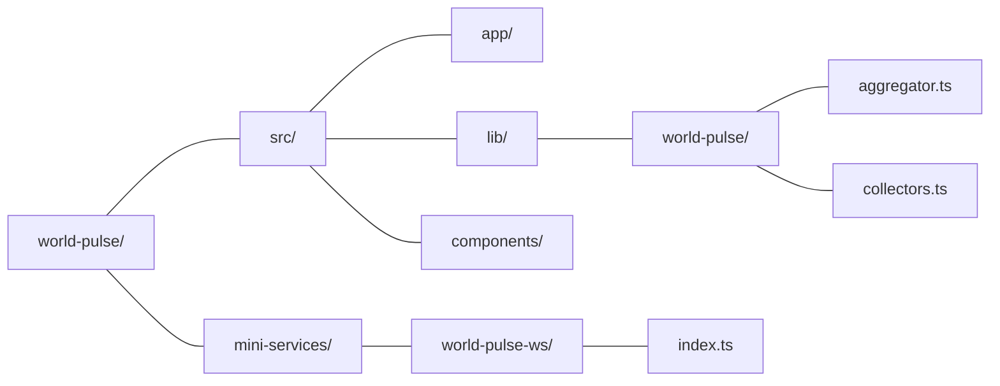

# World Pulse

Real-Time Global Intelligence Dashboard. visualizes global data: flights, blockchain transitions, market indices, and sports.

##  Architecture

The system follows a **Modular Distributed** architecture, separating data ingestion from the presentation layer. Below is the detailed architectural breakdown using the **C4 Model**.

### 1. System Context
High-level view of how users and external systems interact with World Pulse.



### 2. Containers
The technical building blocks of the system.



### 3. Components
Internal structure of the Streaming Service (WebSocket Server).



##  Original Architecture (Simplified)



##  Data Flow



##  Project Structure



##  Execution

```bash
# Main app environment
bun install
bun run dev

# WebSocket service environment
cd mini-services/world-pulse-ws
bun install
bun run dev
```

---
© 2026 Selma Haci - World Pulse - MIT License
